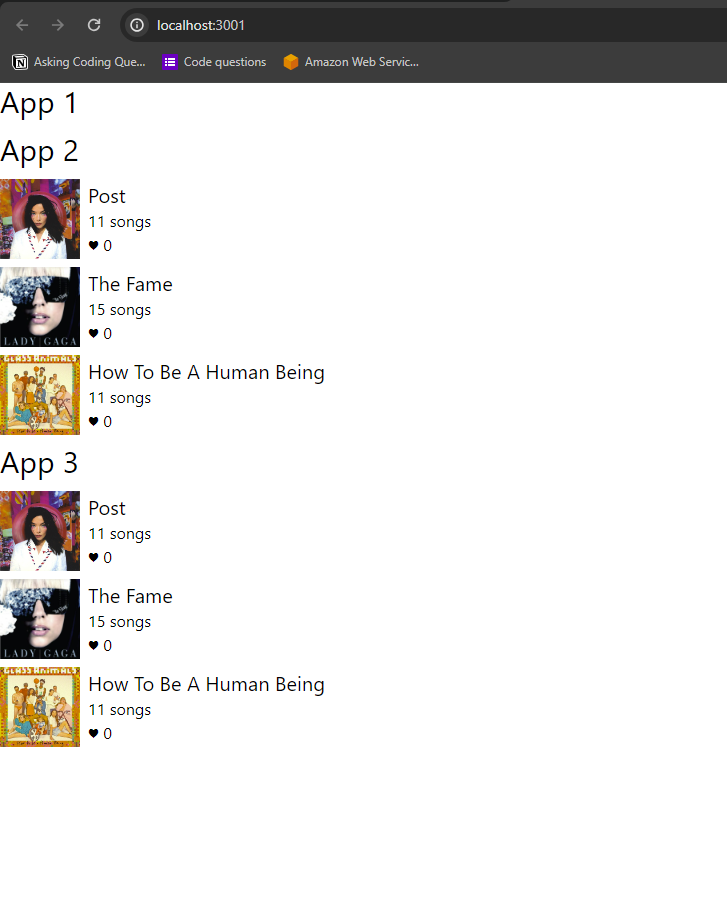

## RSC as a Service

This demonstrates how you can server RSC as a Service over HTTP APIs.

### Setup

We have `simple-rsc-1` app as the "host" app which consumes both `simple-rsc-2` & `simple-rsc-3`.

### Architecture

```
                       simple-rsc-2
                      /
client -> simple-rsc-1
                      \
                       simple-rsc-3
```

### Running Project

#### Build & Run App 1

1. `cd simple-rsc-1`
1. `npm i` _(if you have not already)_
1. `node server.js` (this will start the server on port `3001` and output a `build/` folder)

#### Build & Run App 2

1. _Open another terminal_
1. `cd simple-rsc-2`
1. `npm i` _(if you have not already)_
1. `node server.js` (this will start the server on port `3002` and output a `build/` folder)

#### Build & Run App 3

1. _Open another terminal_
1. `cd simple-rsc-3`
1. `npm i` _(if you have not already)_
1. `node server.js` (this will start the server on port `3003` and output a `build/` folder)

> **Once all 3 apps are runnings, navigate to `http://localhost:3001` in the browser.**
> 
> **You should see all 3 apps render in parallel.**

### Screenshot



### Now What?

- You can test out shutting down App 2 or 3 and refreshing App 1 in the browser to see what happens.
- You can make changes and rerun App 2 or 3 and refresh App 1 *(without having to restart)* to see those changes dynamically.
